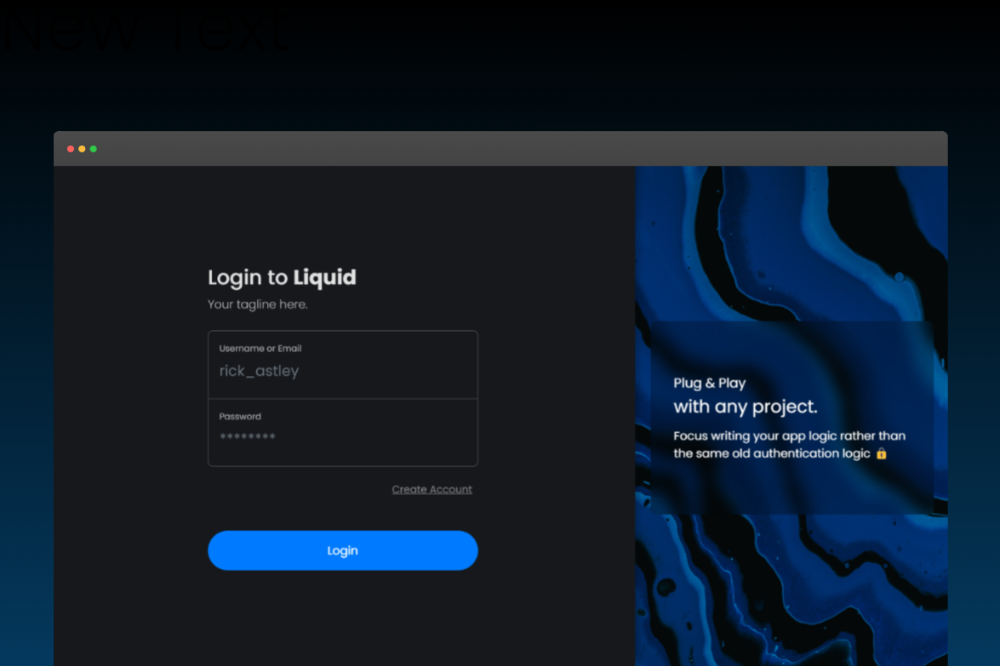

# Liquid - Seamless authentication and user APIs for your projects.

An open source TypeScript implementation of [oauthjs/node-oauth2-server](https://github.com/oauthjs/node-oauth2-server) based Mongo DB and Redis with user sign up and login✨

When you start new projects, you typically find that you are writing the login, account creation and authentication logic over and over again. This repository provides a plug and play boiler plate code that acts as an authentication and user management server for your other microservices.

In addition to OAuth, the service provides additional (but usually very needed) functionalities like profile info fetch and follow-unfollow APIs.



You will require Redis to run this service. This is because the service needs to store access and refresh tokens. If you don't want a Redis dep, it is possible force the service into using MongoDB as a replacement by changing the option `privilege.can-use-cache-for-token` to false. However, disabling this option is highly discouraged since tokens that are not revoked permanently stick to the database.

### Setup

1. Run `npm i`.
2. Copy and rename file `src/public/app-config.sample.json` to `config.json` and replace with your strings.
3. You can override parameters like MongoDB connection string by using the env name present in `src/service/configuration/options.json`.
4. Create the following client document in the `clients` colelction:

```
{
  "_id": {
    "$oid": "633972976aaa0ba6952f86db"
  },
  "id": "application_client",
  "grants": [
    "client_credentials",
    "authorization_code",
    "refresh_token"
  ],
  "redirectUris": [
    "your_frontend_uri"
  ],
  "secret": "your_secret",
  "role": "INTERNAL_CLIENT"
}
```

5. Start the server using command `npm run start:dev` (Or better yet, press the debug button if you are on VS Code). Your service should be running on http://localhost:3000.
6. Run `npm run build` to output production ready code.

### API Documentation:

In development environment, swagger is available at http://localhost:3000/docs. This has the documentation for all the additional functionalities that the service offers apart from OAuth. For OAuth itself, any regular OAuth documentation should work with this. OAuth related functionalities are available at `/oauth`.

### Sign Up:

1. To create an account, visit `/signup` and fill the details.
2. Click on Create Account.
3. If you are running this on dev mode, a code is printed in your console. Enter this code on the verification page.

### Login:

1. To login, visit `/login` and enter your credentials.
2. If the credentials are correct, the application redirects to your client's reditect URI (Configured in Setup(2)) with the state and authorization code.
3. In your application logic, you can use this code in exchange for an access and refresh token using the `authorization_code` grant.
