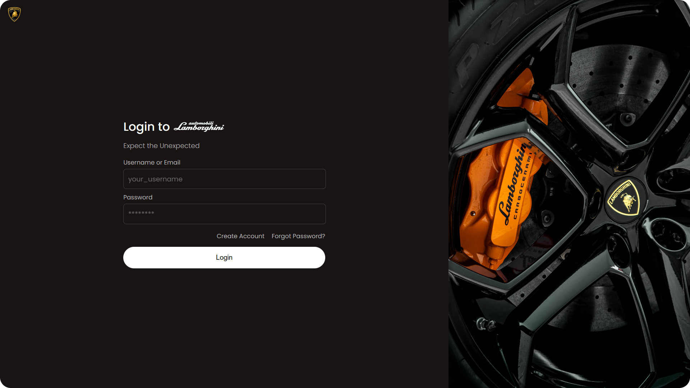

#  Liquid: Seamless and highly customizable authentication and user management server for any project.

Liquid is a Docker-based open-source authentication server that supercharges your product development by offering out of the box APIs for features like follow-unfollow, blocking, and banning so that you can focus on just your application logic. 🚀

## ⭐ Features

- **Plug & Play:** With the Liquid docker package, say goodbye to complex environment setup. Once you have docker installed, [setup](https://github.com/shrihari-prakash/liquid/wiki#quick-start) takes less than 5 minutes!
- **High degree customization capabilities:** Customize and configure every part of the UI and service so login pages can look like your own.
  
- **OAuth Based Authentication:** Secure and seamless authentication based on a battle tested OAuth core powered by [node-oauth2-server](https://github.com/node-oauth/node-oauth2-server) from [@node-oauth](https://github.com/node-oauth).
- **Social Features:** Liquid is more than just an authentication screen. Liquid comes with out of the box support for social features like follow - unfollow, private accounts and blocking.
- **Invite-Only Access:** Using the optional invite-only sign-up feature can be an effective way to create virality because it encourages existing users to invite their network to join the product. This also doubles as a spam account prevention system by ensuring a controlled userbase growth.
- **2FA:** Secure user logins with email based Two-Factor Authentication.
- **Admin Controls:** With [Liquid Nitrogen](https://github.com/shrihari-prakash/nitrogen), spinning up an admin panel takes minutes, but if you want to build your own, Liquid offers administrative APIs that let you edit profile information, ban users, restrict accounts and do a lot more.
  
- **Profile Pictures:** Provide users with the option to personalize their profiles with profile pictures.
- **Microservice Integration:** Seamlessly integrate Liquid into your project, allowing other microservices to utilize its robust authentication and user management capabilities.
- **Advanced Scope Management:** Granular access control to APIs through Liquid's sophisticated scope management solution. Liquid also lets you add your own scopes into it so you can also use scopes in your other microservices.
- **Gamification Support:** Includes APIs for reward points mechanisms. This can be used for inroducing features like loyalty points, or in-app virtual money.
- **Small Image Size:** Tiny ~60MB image download.

## ⚙️ Setup

#### For setup instructions and documentation, see the [Liquid Wiki](https://github.com/shrihari-prakash/liquid/wiki).

## 🪪 License

Liquid is released under the [MIT License](https://github.com/shrihari-prakash/liquid/blob/main/LICENSE).

## ❗ Issues

Have questions or need support? Open a discussion [here](https://github.com/shrihari-prakash/liquid/discussions).

Experiencing issues? Open an issue [here](https://github.com/shrihari-prakash/liquid/issues).
